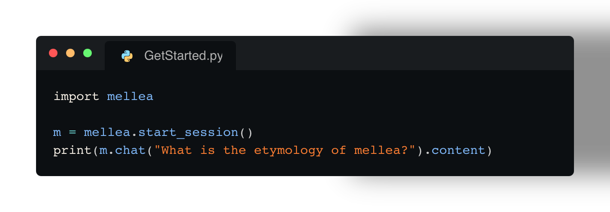

# Mellea

Mellea is a library for writing generative programs.
Generative programming replaces flaky agents and brittle prompts
with structured, maintainable, robust, and efficient AI workflows.


[//]: # ([![arXiv]&#40;https://img.shields.io/badge/arXiv-2408.09869-b31b1b.svg&#41;]&#40;https://arxiv.org/abs/2408.09869&#41;)
[](../)
[](https://pypi.org/project/mellea/)
[](https://pypi.org/project/mellea/)
[](https://github.com/astral-sh/uv)
[](https://github.com/astral-sh/ruff)
[](https://github.com/pre-commit/pre-commit)


## Features

 * A standard library of opinionated prompting patterns.
 * Sampling strategies for inference-time scaling.
 * Clean integration between verifiers and samplers.
    - Batteries-included library of verifiers.
    - Support for efficient checking of specialized requirements using
      activated LoRAs.
    - Train your own verifiers on proprietary classifier data.
 * Compatible with many inference services and model families. Control cost
   and quality by easily lifting and shifting workloads between:
        - inference providers
        - model families
        - model sizes
 * Easily integrate the power of LLMs into legacy code-bases (mify).
 * Sketch applications by writing specifications and letting `mellea` fill in
   the details (generative slots).
 * Get started by decomposing your large unwieldy prompts into structured and maintainable mellea problems.


## Getting Started


Install with pip:

```bash
uv pip install .
```

For running a simple LLM request locally (using Ollama with Granite model), this is the satrting code:
```python
# filename: example.py
import mellea

m = mellea.start_session()
print(m.chat("What is the etymology of mellea?").content)
```


Then run it:

```shell
uv run mellea example.py
```

### Installing from source

Fork and clone the repositoy:

```bash
git clone ssh://git@github.com/<my-username>/mellea.git && cd mellea/
```

Setup a virtual environment:

```bash
uv venv .venv && source .venv/bin/activate
```

Use `uv pip` to install from source with the editable flag:

```bash
uv pip install -e .
```

Ensure that you install the precommit hooks:

```bash
pre-commit install
```

## Getting started with validation

Mellea supports validation of generation results through a **instruct-validate-repair** pattern.
Below, the request for *"Write an email.."* is constrained by the requirements of *"be formal"* and *"Use 'Dear interns' as greeting."*.
Using a simple rejection sampling strategy, the request is send up to three (loop_budget) times to the model and
the output is checked against the constraints using (in this case) LLM-as-a-judge.


```python
# filename: example_val.py
from mellea import MelleaSession
from mellea.backends.types import ModelOption
from mellea.backends.ollama import OllamaModelBackend
from mellea.backends import model_ids
from mellea.stdlib.sampling import RejectionSamplingStrategy

# create a session with Mistral running on Ollama
m = MelleaSession(
    backend=OllamaModelBackend(
        model_id=model_ids.MISTRALAI_MISTRAL_0_3_7b,
        model_options={ModelOption.MAX_NEW_TOKENS: 300},
    )
)

# run an instruction with requirements
email_v1 = m.instruct(
    "Write an email to invite all interns to the office party.",
    requirements=["be formal", "Use 'Dear interns' as greeting."],
    strategy=RejectionSamplingStrategy(loop_budget=3),
)

# print result
print(f"***** email ****\n{str(email_v1)}\n*******")
```


## Getting Started with Generative Slots

Generative slots allow to define functions without implementing them.
By using the `@generative` decorator, the function gets converted into an LLM function.
The example below, is a minimal version of writing a sentiment classification function
using Mellea's generative slots and a local LLM


```python
from typing import Literal
from mellea import generative, start_session


@generative
def classify_sentiment(text: str) -> Literal["positive", "negative"]:
  """Classify the sentiment of the input text as 'positive' or 'negative'."""


if __name__ == "__main__":
  m = start_session()
  sentiment = classify_sentiment(m, text="I love this!")
  print("Output sentiment is:", sentiment)
```


## Tutorial

See the [tutorial](docs/tutorial.md)

## Contributing

Please refer to the [Contributor Guide](docs/tutorial-wip.md) for detailed instructions on how to contribute.

### IBM ❤️ Open Source AI

Mellea has been started by IBM Research in Cambridge, MA.


